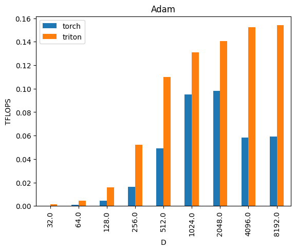
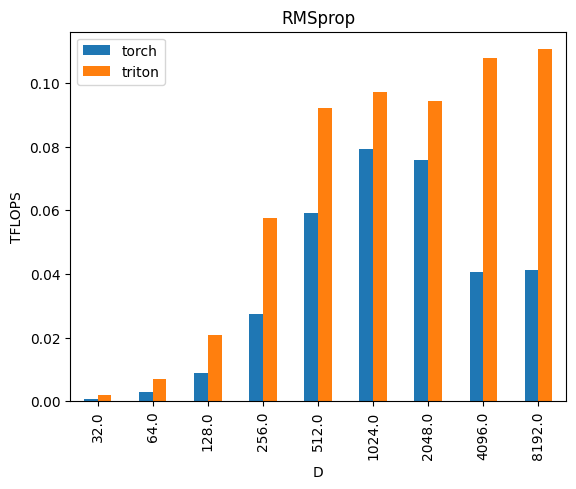

# triton-optimizers


Fused implementation of the most famous optimizers via triton-lang. All the optimizers are compatible with `torch.optim` module, so you ther's no need for heavy change in your code, just import the optimizer you want and use it! The autotuning is done via `triton-dejavu` (see [here](https://github.com/IBM/triton-dejavu)), which automatically caches the best configs found by the autotuner, so you'll need to run the autotuning only once (per machine) and always use the fastest confiugurations.


## Installation
Follow these steps:
1. clone the repo and `cd triton-optimizers`
1. `make install` to set-up all the stuff and create the vistualenv
2. `properly set-up `triton-dejavu`, providing a folder with proper permissions to cache the optimal parameters found by the autotuner:
```shell
sudo mkdir -p $(pwd)/triton_dejavu_cache/
sudo chmod o+rw $(pwd)/triton_dejavu_cache/
echo "export TRITON_DEJAVU_STORAGE=$(pwd)/triton_dejavu_cache" >> ~/.bashrc # needed for triton-dejavu
```
3. `make install` to install all the project dependencies and the package

## Autotuning
It is strongly suggested to run, as first thing after the installation, the command
```shell
make autotune
```
this will run the autotuner and cache the best configs.

## Usage
A simple example:
```python

import torch
from torch import nn
from triton_optimizers.optim.adam import Adam 

DEVICE = torch.device("cuda:0")
D = 16
model = nn.Linear(D, D, bias=False).to(DEVICE)
x = torch.rand(D, D, device=DEVICE)

optim = Adam(model.parameters()) # same semantics as torch native optim

optim.zero_grad()
y = model(x)
loss = y.sum()
optim.step()
```

## Benchmarks




